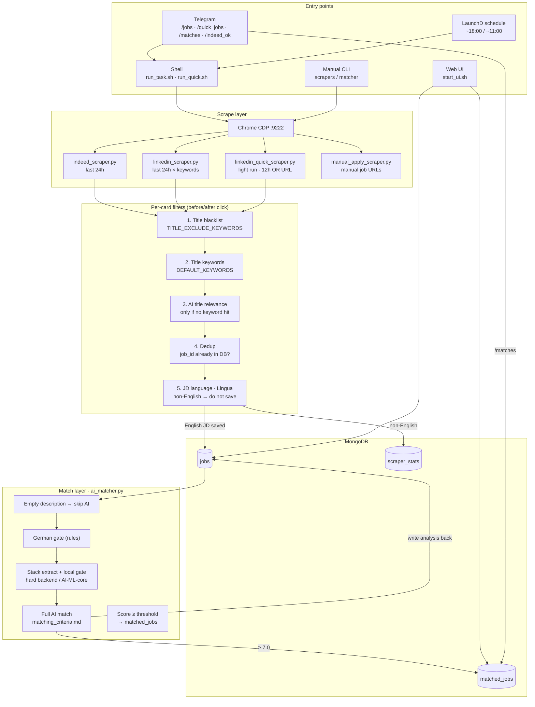
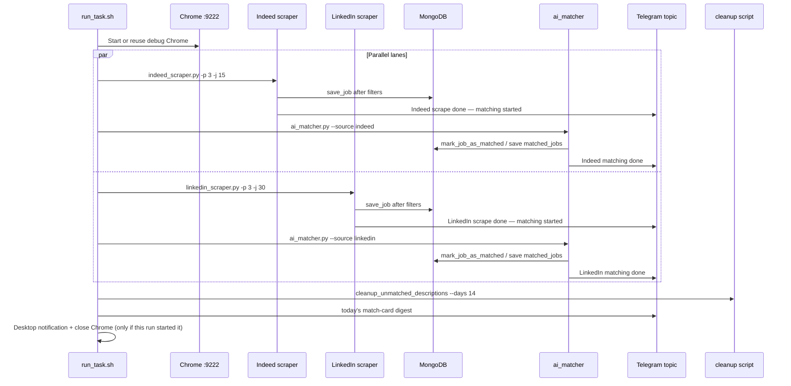
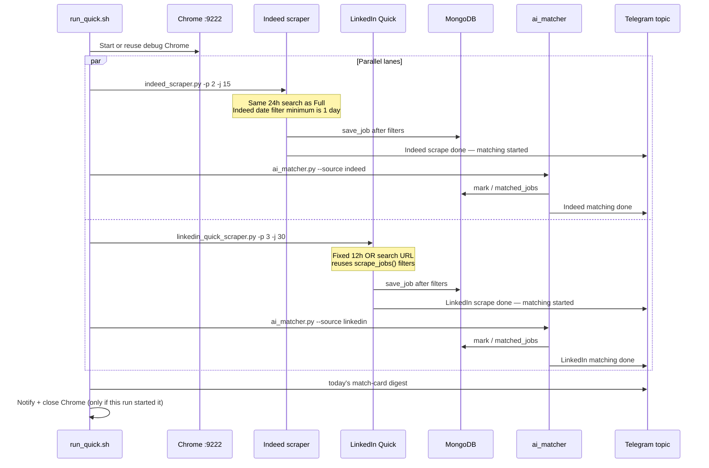
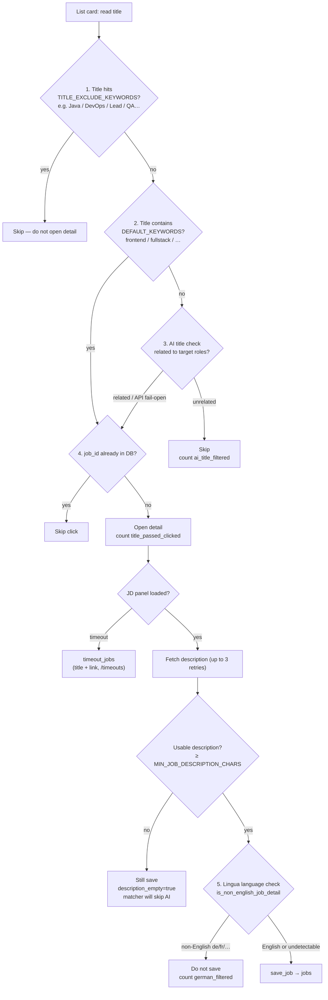
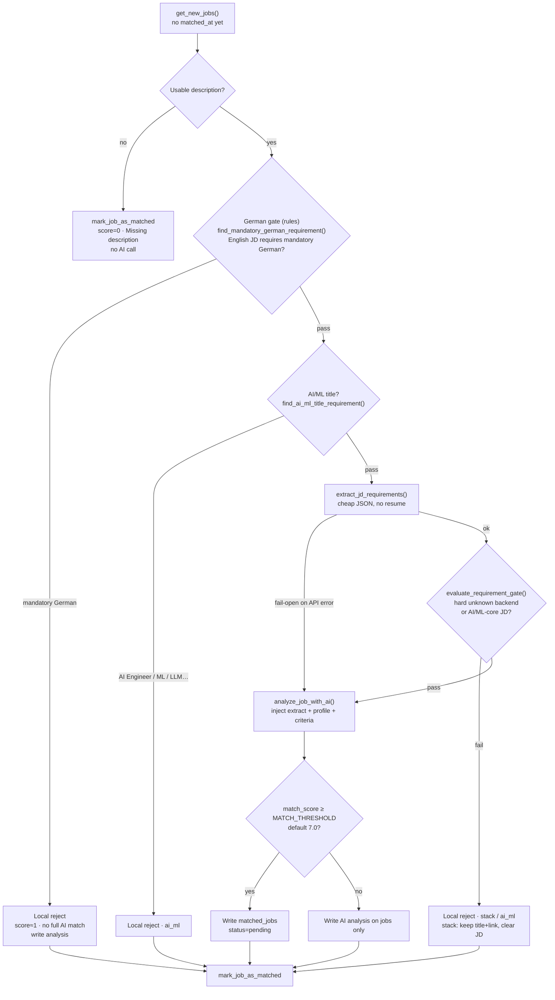

# Job Scraper — Architecture & Flows

This document describes the current architecture, entry commands, and the full chain: scrape → filter → AI match.

All project docs and code comments are written in English.

---

## 1. System overview



---

## 2. Commands / entry points

### 2.1 Daily pipelines

| Command | When | What it does | Typical time |
|---------|------|--------------|--------------|
| `./run_task.sh` | ~18:00 (or Telegram `/jobs`) | Full: Indeed + LinkedIn lanes in parallel (24h, 3 pages/keyword). Each source matches as soon as its scrape finishes, with Telegram pings; digest after both lanes; then cleanup old unmatched descriptions | 40–60 min |
| `./run_quick.sh` | ~11:00 (or Telegram `/quick_jobs`) | Light: Indeed (24h, 2 pages/keyword) + LinkedIn quick URL (12h, 3 pages) lanes in parallel. Same per-source match + pings; digest after both lanes | 20–40 min |
| `./start_ui.sh` | Anytime | Start Job Tracker Web UI (default `:5050`) | — |

Prefer `caffeinate -i` for manual runs so sleep does not interrupt Playwright:

```bash
caffeinate -i ./run_task.sh
caffeinate -i ./run_quick.sh
```

### 2.2 Telegram bot commands

| Command | Purpose |
|---------|---------|
| `/start` | Confirm bot is online |
| `/test` | Confirm the Mac is connected and ready |
| `/jobs` | Run `run_task.sh` in the background; per-source scrape/match pings; “Done” when both lanes finish |
| `/quick_jobs` | Run `run_quick.sh` in the background; same per-source pings; “Done” when both lanes finish |
| `/matches` | Push today’s `matched_jobs` without scraping |
| `/indeed_ok` | Resume Indeed after human verification (also: inline **Continue** button) |

**Per-source progress:** each lane sends two short Telegram notes — scrape done (matching started), then matching done. Indeed and LinkedIn do not wait for each other to start matching.

**Match card push:** `run_task.sh` / `run_quick.sh` call `core.match_digest.push_todays_matched_jobs()` only after **both** lanes finish. That covers Telegram `/jobs` / `/quick_jobs`, launchd, and any manual shell run. `/matches` uses the same digest helper without scraping.

**Single-flight lock:** `run_task.sh` / `run_quick.sh` write `logs/pipeline.pid`. A second `/jobs`, `/quick_jobs`, or shell run exits immediately instead of launching another debug Chrome (same `--user-data-dir` would kill the first Chrome and abort Indeed with `TargetClosedError`). Telegram also checks this pidfile. If Indeed’s tab still dies mid-run, `indeed_scraper` reconnects over CDP and retries that page instead of exiting 1.

**Destination:** Job cards, pipeline Done/error status, and Indeed challenge alerts go to the configured forum topic (`TELEGRAM_CHAT_ID` + `TELEGRAM_MESSAGE_THREAD_ID` — Jiali Personal Hub → Job Assistance). Command authorization stays on `TELEGRAM_ALLOWED_USER_ID` (your personal account). Slash-command replies (`/start`, Started, …) stay in the topic you typed in; send commands from Job Assistance so those stay there too.

Start the bot: `python3 src/bot/telegram_bot.py`

### 2.2.1 Indeed human verification handshake

Indeed sometimes shows a captcha / “press and hold” challenge. The scraper **does not solve** that check. It:

1. Detects the challenge page (URL / captcha widgets / challenge copy)
2. Sends a Telegram alert with a **Continue** button
3. Pauses (up to 45 minutes) until **either** the job list is back in Chrome **or** you confirm
4. Reloads the SERP and continues the same keyword / page

You complete the check in the debug Chrome window. When the SERP returns, the scraper continues on its own. Optional confirm: tap **Continue**, send `/indeed_ok`, or (bot offline) `touch logs/indeed_human_resume.flag`.

If Indeed’s tab/browser closes mid-run (`TargetClosedError`), the scraper reconnects to the debug Chrome and retries the current results page instead of aborting the lane.

Indeed pacing is slower and more human-like than LinkedIn: random think-time before each card click, hold-delay on click, longer rests between cards (~5–11s), pages (~35–80s), and keywords (~30–70s).

### 2.3 Standalone CLI (debug / partial runs)

| Command | Purpose |
|---------|---------|
| `python3 src/scrapers/indeed_scraper.py [-k …] [-p N] [-j N]` | Indeed only (default 3 pages × 15) |
| `python3 src/scrapers/linkedin_scraper.py [-k …] [-p N] [-j N]` | Full LinkedIn keyword loop (default 3 pages × 30) |
| `python3 src/scrapers/linkedin_quick_scraper.py [-p N] [-j N]` | LinkedIn 12h quick URL (default 3 pages × 30) |
| `python3 src/matching/ai_matcher.py [-l N] [-s source] [-t 7.0]` | AI match only (jobs without `matched_at`) |
| `python3 src/scrapers/manual_apply_scraper.py <urls…>` | Manual job URLs → scrape + score → `matched_jobs` (default `status=pending`; `--status applied` optional) |
| `python3 scripts/cleanup_unmatched_descriptions.py …` | Clear old unmatched JD text (also run at end of full pipeline) |
| `python3 scripts/cleanup_excluded_titles.py …` | Cleanup DB rows by title blacklist |
| `python3 scripts/eval_matcher.py …` | Matcher evaluation |

---

## 3. Full vs Light pipelines

### 3.1 Full — `run_task.sh` / `/jobs`



Order:

1. Chrome remote debugging (reuse if `:9222` already open)
2. **Indeed + LinkedIn lanes in parallel** — 3 pages per keyword. Indeed processes about 15 cards per page (`start` steps by 15). LinkedIn processes up to 30 cards per page.
3. As soon as a source finishes scraping → **AI matcher for that source only** (`--source indeed` / `--source linkedin`) + Telegram ping
4. After both lanes finish → clear descriptions on unmatched jobs older than 14 days
5. Push today's match-card digest + optionally close Chrome

Indeed search URL (`INDEED_CONFIG`): `de.indeed.com/jobs?q=<keyword>&l=&fromage=1`. Location stays empty (same as the desktop SERP). Hyphens in keywords are sent as spaces (`full-stack` → `q=full+stack`) so the query matches typing “Full Stack” in the search box. Each keyword still walks only 3 pages × ~15 cards.

### 3.2 Light — `run_quick.sh` / `/quick_jobs`



Differences from Full:

- **Both platforms**, still in parallel lanes (scrape → match that source)
- Indeed stays on the 24h search (`fromage=1`, empty `l=`; the site cannot filter shorter than 1 day) and walks **2 pages per keyword** instead of 3
- LinkedIn does **not** loop keywords — one pre-built OR search URL (Full Stack / Frontend / Product / GenAI, `f_TPR=r43200` = 12h), **3 pages × 30 cards**
- **No** description cleanup step
- LinkedIn card processing reuses `linkedin_scraper.scrape_jobs()` (same title + language filters). The quick URL is the SDUI `/jobs/search-results/` page: cards are `[componentkey^="job-card-component-ref-"]`, and the next page control is `pagination-controls-next-button-visible`

Budgets are defined in `src/core/config.py` (`FULL_*`, `LIGHT_*`, `INDEED_JOBS_PER_PAGE`, `LINKEDIN_JOBS_PER_PAGE`). Both shell scripts read those values at start.

---

## 4. Per-job funnel: list card → database

For every list card during scrape:



### What each stage does

| Step | Implementation | Purpose |
|------|----------------|---------|
| 1. Title blacklist | `is_title_excluded()` · `TITLE_EXCLUDE_KEYWORDS` | Skip clearly wrong roles before clicking. `Cloud` only matches Cloud Engineer / Architect / similar roles, not “Cloud SaaS” in a frontend title. |
| 2. Keyword hit | `title_matches_default_keywords()` · `DEFAULT_KEYWORDS` | Title already on-target → click without AI |
| 3. AI title screen | `is_title_relevant_by_ai()` | After blacklist + no keyword: cheap AI “is this a target role?” |
| 4. Dedup | `is_job_id_exists()` | Do not re-open known jobs |
| 4b. Detail timeout | `save_timeout_job()` | Title passed but JD panel missing → `timeout_jobs` for `/timeouts` |
| 5. JD language | `is_non_english_job_detail()` · Lingua | **JD body not English** (usually German posts) → **do not save**. UI: German Filtered |

> Step 5 answers “what language is the JD written in?”, not “does an English JD require German skills?”. The latter is the match-stage German gate.

Unified title-gate entry point:

`should_skip_title_before_click()` → `src/core/scraper_utils.py`

---

## 5. After save: pre-AI and AI matching

`ai_matcher.py` only processes `jobs` documents that still lack `matched_at`:



### Do not confuse the two German-related gates

| | Scrape · language detection | Match · German gate |
|--|-----------------------------|---------------------|
| **Module** | `scraper_utils.is_non_english_job_detail` | `matching/german_gate.py` |
| **Question** | What language is the JD **written in**? (Lingua) | Does an **English** JD require German as a must-have skill? |
| **Typical hit** | Entire German posting | “German fluent required”, “C1 Deutsch”, “must speak German” |
| **Does not hit** | — | “Berlin, Germany” alone, German company, German as nice-to-have |
| **Outcome** | **Not saved**; count `german_filtered` | **Saved then rejected**; low score; **no full AI scoring** |
| **Order** | Earlier (on detail fetch) | Later (matcher entry) |

The AI prompt / `matching_criteria.md` also describes a German gate as a fallback. In code, the rule-based `german_gate` runs first and skips the model when it hits.

### Match-stage gates after German

| | Backend-stack gate | AI/ML-core gate |
|--|--------------------|-----------------|
| **Module** | `matching/stack_gate.py` | same extract; plus title regex |
| **Question** | Is a hard/implied backend a language the candidate cannot do in production? | Is this an AI/ML *engineering* job (train/fine-tune/LLM stack), not product UI that uses AI? |
| **Typical hit** | Python/Java/Go/Kotlin required in Requirements, even without “must-have” | “AI Engineer”, “Software Engineer” whose JD is training models |
| **Does not hit** | Node or Python (OR); junior “willingness to learn Java”; frontend role whose company backend is Go | Frontend/fullstack at an AI company; Copilot / shipping LLM product features |
| **Outcome** | Local reject; **no full AI scoring**. Stays on Unmatched as a title + link stub (JD cleared) so the filter can be reviewed | Local reject; **no full AI scoring** |
| **Extract fail** | Fail-open to the full scorer | Fail-open (title regex still runs) |

Candidate production backends: Node.js / TypeScript-backend / JavaScript-backend. Python is **not** production. Mixed AND-stack (Python **and** TypeScript both hard) now fails; it is no longer floored at 7.0.

`evaluate_job()` in `ai_matcher.py` is the shared path (daily matcher, eval, manual job log).

### AI scoring order (criteria)

1. Hard gates (code first, then scorer fallback): mandatory German → unknown/non-production hard backend → AI/ML-core → years too high → DevOps/SRE-core
2. Ordinary score 4–8 (required skills + nice-to-have / domain bonuses)
3. Special Match A/B/C → 9–10 (Leipzig can add +0.5–1)
4. `match_score ≥ threshold` → `matched_jobs`

Details: [`matching_criteria.md`](./matching_criteria.md).

---

## 6. Data stores

| Collection | Written by | Contents |
|------------|------------|----------|
| `jobs` | scrapers; matcher writes analysis back | Jobs that passed the language gate (including empty-description placeholders). Matcher also stores `match_gate` (`german` / `stack` / `ai_ml` / `scored`) and `requirement_extract`. Stack-gate rejects clear `description` immediately (title + link stub for Unmatched review). |
| `matched_jobs` | matcher (≥ threshold); manual job log (`/manual-apply`, default `pending`); unmatched **Can Apply** override; **timeout review Add as Not Applied** | High-score matches / manually logged jobs / user-promoted unmatched or timeout jobs. UI can store manual `highlights` tags (separate from AI `special_match`). |
| `timeout_jobs` | scrapers, when the title passed but the JD panel timed out | Title + link for later review (`/timeouts`). Open → **Add as Not Applied** (`pending`) or Dismiss. |
| `scraper_stats` | scrapers | Counters: `title_passed_clicked`, `german_filtered`, `ai_title_filtered`, `detail_timeout`, … |

Web UI (`web_app.py`) reads these for today’s funnel, match list, unmatched reasons, and scrape timeouts.

**Log Job page (`/manual-apply`):** paste job URLs (LinkedIn / Indeed / career pages). Scrapes + AI-scores each URL into `matched_jobs`. Default status is **Not Applied** (`pending`); choose **Applied** only when you already applied (optional applied date).

**Timeouts page (`/timeouts`):** cards whose **title already passed** the scrape gates but the detail panel did not load in time. These are not saved to `jobs` (no JD). You open the original link and, if it is a real match, **Add as Not Applied** — that copies the card into `matched_jobs` as `pending`. Cards with no readable title (typical Indeed ad/empty slots, ~1 per SERP page) are not listed.

**Unmatched page (`/unmatched`):** any job below the match threshold can be marked **Can Apply** (`user_status=watchlist`). That copies it into `matched_jobs` as `pending` (does not overwrite an existing Tracker row) so it can be tracked or marked applied. This is a manual override when AI scoring was wrong; it is not limited to the 6–7 score band. Stack-gate rejects are stored without the JD (title, company, link, and the short stack reason only); filter the page by **Stack reject** to review them.

**Tracker Other statuses:** `unsuitable`, `closed`, `repost`, and Reset Not Applied (`pending`). These clear application progress and are not counted as applied. `repost` is a manual mark when the same role was posted again as a new listing and does not need another application.

AI `special_match` / `special_match_reasons` are still written by the matcher for scoring (9–10 band) but are **not** shown as badges on the Tracker. Highlight badges on the matched-jobs page come only from the user-editable `highlights` list (`PATCH /api/jobs/<id>/highlights`).

---

## 7. Directory map

```
job_scraper/
├── run_task.sh / run_quick.sh / start_ui.sh   # main entry scripts
├── docs/
│   ├── architecture.md          # this file
│   ├── matching_criteria.md     # AI scoring source of truth
│   └── user_profile.md          # resume / profile
├── src/
│   ├── core/
│   │   ├── config.py            # keywords, title blacklist, platform URLs
│   │   ├── db_mongo.py          # Mongo helpers
│   │   ├── scraper_utils.py     # title gates, Lingua, CDP helpers
│   │   ├── challenge_wait.py    # Indeed captcha detect + auto-continue / Telegram resume
│   │   ├── pipeline_lock.py     # Single-flight pidfile for run_task / run_quick
│   │   ├── telegram_notify.py   # Sync Bot API helper (scraper alerts)
│   │   └── match_digest.py      # Today's match cards → Telegram (pipeline + /matches)
│   ├── scrapers/                # Indeed / LinkedIn / Quick / Manual
│   ├── matching/
│   │   ├── ai_matcher.py        # match orchestration (`evaluate_job`)
│   │   ├── german_gate.py       # mandatory-German rule gate on English JDs
│   │   └── stack_gate.py        # extract + local backend / AI-ML-core gate
│   ├── web/web_app.py           # Tracker UI
│   └── bot/telegram_bot.py      # Telegram commands (+ Indeed resume)
└── scripts/                     # pipeline_common.sh, cleanup / eval helpers
```

---

## 8. One-line funnel

> **Title gates (blacklist → keywords → AI title) → open detail → discard non-English JD → save English JD → matcher skips empty desc → mandatory-German rule gate → stack extract + backend/AI-ML local gate → AI scores by criteria → ≥ 7 enters Tracker.**

The two daily commands only change *how much* to scrape. Evening Full is 24h on both platforms, 3 pages per keyword (Indeed ~15 cards/page, LinkedIn 30). Morning Light runs both in parallel: Indeed the same 24h search for 2 pages per keyword, LinkedIn the 12h quick URL for 3 pages. Each source starts AI matching as soon as its scrape finishes; job cards are pushed only after both lanes complete. **Filter and match rules are the same.**
